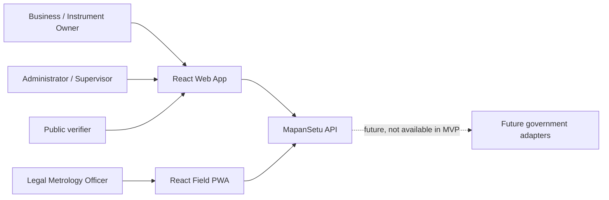
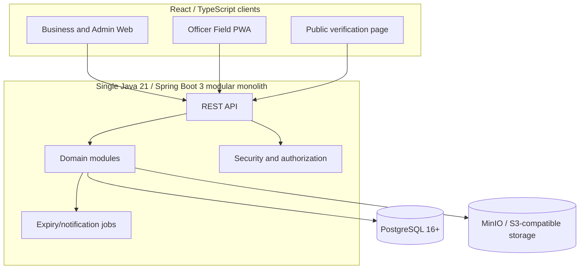
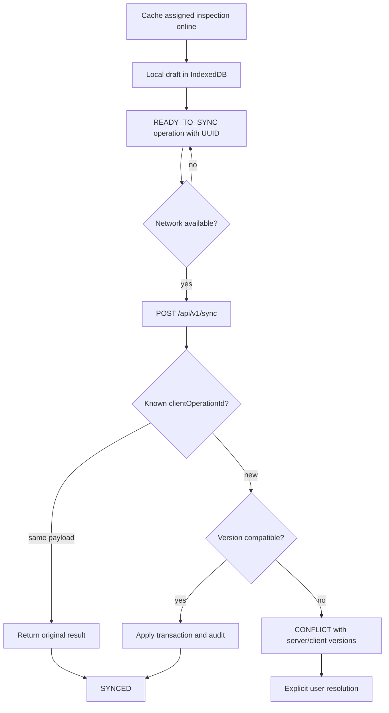

# System Architecture

This document describes the frozen MapanSetu modular monolith. It is an implementation design, not an implementation task.

## 1. Context diagram



The software records and coordinates verification work. Physical/statutory verification remains with authorized personnel.

## 2. Container diagram



## 3. Component/module diagram

The backend package root is `com.mapansetu` with modules:

```text
common, auth, user, business, instrument, application, scheduling,
inspection, evidence, certificate, verification, notification, audit, sync
```

Each module should expose an application/service boundary and keep persistence mapping internal. Cross-module calls use service interfaces or events within the same process; modules do not access another module’s tables through ad hoc queries.

## 4. Request and data flow

1. Web or field client sends an authenticated request (or public verification request).
2. API validates DTO shape and normalizes errors.
3. Spring Security authenticates and authorization checks role plus ownership/assignment.
4. Domain module validates state transition and performs a transaction.
5. PostgreSQL stores domain records; MinIO stores validated binary artifacts.
6. AuditLog is appended for material actions; notifications are created where configured.
7. Response returns canonical resource fields from the API contract.

The field client may first write locally. Its sync operation later follows the same authorization, validation, idempotency, conflict, and audit path.

## 5. Certificate trust flow

```mermaid
sequenceDiagram
  participant Officer
  participant API
  participant DB
  participant Storage
  participant Public
  Officer->>API: Submit eligible decision
  API->>DB: Build and persist canonical certificate payload
  API->>API: SHA-256 payload; RSA-PSS/SHA-256 sign
  API->>Storage: Store PDF artifact
  API->>DB: Store hash, signature metadata, QR URL
  Public->>API: Verify certificate number
  API->>DB: Load payload/status/signature
  API->>API: Verify signature using public key
  API-->>Public: VALID/EXPIRED/REVOKED/INVALID minimal response
```

QR is lookup/discovery only. It is not the cryptographic security mechanism. See [CRYPTOGRAPHY.md](CRYPTOGRAPHY.md).

## 6. Offline sync flow



## 7. Authentication flow

The client submits credentials to `/auth/login`; Spring Security validates the account and returns a short-lived JWT access token. Each protected request carries the bearer token. The backend checks token validity, role, business ownership, and officer assignment. Logout/refresh/storage policy remains a security implementation decision, but secrets must not be persisted in shared packages or logs.

## 8. Audit flow

Material actions append an AuditLog event containing actor, action, entity, timestamp, metadata, previous hash, and current hash. The chain is tamper-evident, not absolutely immutable. Audit metadata excludes passwords, tokens, private keys, and unnecessary personal data.

## 9. Deployment architecture

Local/SIH deployment uses Docker Compose for PostgreSQL, MinIO, API, and Nginx/static web assets as needed. Development ports are Web `5173`, Field `5174`, API `8080`, PostgreSQL `5432`, MinIO API `9000`, and MinIO console `9001`. Production deployment may move to managed PostgreSQL and S3-compatible storage, but that is future scope.

## 10. Security boundaries

- Browser clients are untrusted; protected routes are UX only.
- API authorization is authoritative.
- PostgreSQL is the transactional system of record.
- MinIO objects are accessed through controlled server policy, not public credentials.
- Certificate private keys exist only in protected backend runtime/key custody.
- Public verification returns minimal data and is rate-limited.
- Future government adapters are isolated extension points and are not active integrations.

## 11. Data ownership boundaries

Business owns its profile, instruments, applications, and permitted certificate history. Officers own their inspection actions only within assigned/authorized work. Admins administer the prototype scope and are audited. The public owns no stored account or role and receives only minimal certificate verification data.

## 12. Future extension points

Potential future adapters include jurisdiction configuration, external identity, government case systems, production PKI/HSM, notification providers, analytics export, and AI providers. Each requires a new contract/ADR and must not alter the MVP stack implicitly.

## 13. Canonical repository structure

```text
apps/web
apps/field
services/api
packages/types
packages/ui
packages/config
infra
scripts
tests
docs
```

The active backend package root is `services/api/src/main/java/com/mapansetu` and follows the module list above. Archived documents are historical only.

