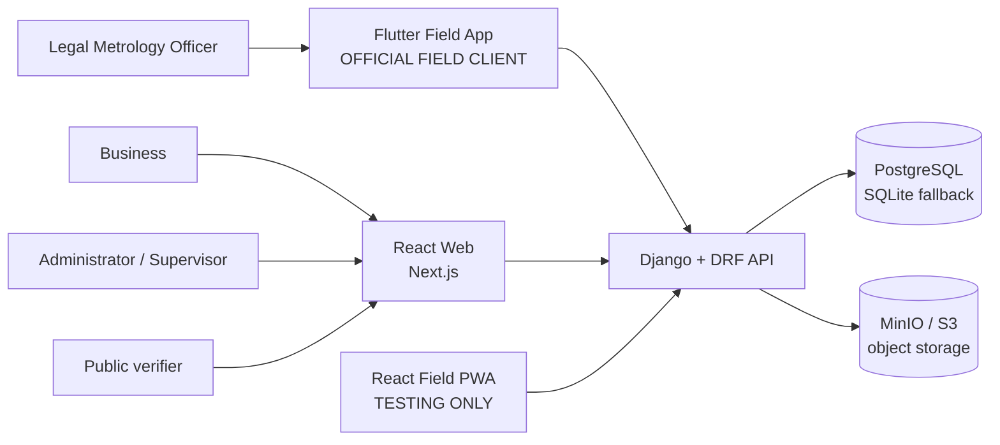
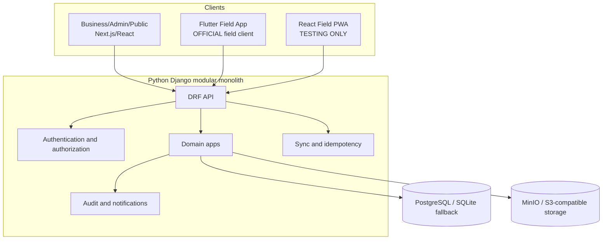

# System Architecture

MapanSetu is a client-independent verification workflow built as one Django modular monolith, one Next.js web application, and one Flutter mobile field application. The current checkout is a working scaffold in several areas; this document defines the boundaries that implementation must preserve.

## 1. System Context

Actors are Business users, Legal Metrology Officers, Administrators/Supervisors, and public verifiers.

- **Business / Admin / Public** web flows run in the Next.js web application.
- **Officer field work** runs in the Flutter field application (`flutter_field_app/`) — the **official** field client.
- The **React field PWA** exists for testing and prototype validation only.
- **Django** is the backend authority.
- **PostgreSQL** is the target system of record; SQLite is a local development fallback.
- **MinIO / S3-compatible** object storage is used for binary artifacts when configured.



The system records and coordinates verification work. It does not perform physical statutory verification or grant legal approval.

## 2. Client Architecture

```
┌─────────────────────────────────────────────────────────┐
│                  CLIENT LAYER                           │
│                                                         │
│  ┌──────────────────────┐   ┌─────────────────────┐   │
│  │    React Web App     │   │  Flutter Field App  │   │
│  │  Business + Admin    │   │   OFFICIAL FIELD    │   │
│  │  + Public Verify     │   │        Dart         │   │
│  └──────────┬───────────┘   └──────────┬──────────┘   │
│             │                          │               │
│             └─────────┬────────────────┘               │
│                       │ HTTPS / /api/v1/               │
└───────────────────────┼─────────────────────────────────┘
                        ▼
┌───────────────────────────────────────────────────────────┐
│             Django 6.1 + DRF Backend API                  │
│         Authentication · RBAC · Domain · Sync · Audit     │
└──────────────────────┬──────────────────────────────────┘
                       │
           ┌───────────┴────────────┐
           ▼                        ▼
     PostgreSQL               MinIO / S3
    (system of record)      (object storage)

React Field PWA → Backend API    [TESTING / PROTOTYPE CLIENT ONLY]
```

## 3. Container and Request Architecture



Every protected request follows: client → API routing → authentication → role/ownership/assignment authorization → serializer/domain validation → Django ORM transaction → object storage where needed → audit/notification → canonical response. Public verification skips login but is rate-limited and returns only minimal public data.

## 4. Backend Architecture

The backend module names are the Django app directories present under `backend/`:

```text
backend/
  root/            settings.py, URL composition, ASGI/WSGI
  common/          shared backend concerns
  authentication/  identity, login, token/session boundary
  businesses/      business ownership
  instruments/     instrument registry
  applications/    verification requests and lifecycle
  scheduling/      assignment and scheduling
  inspections/     inspection session and measurements
  evidence/        file metadata and object-storage boundary
  certificates/    certificate generation and status
  verification/    public certificate lookup
  notifications/   in-product notifications
  audit/           append-only audit boundary
  sync/            offline operation acceptance and idempotency
```

Each domain app may own `models.py`, `serializers.py`, `services.py`, `views.py`, `urls.py`, and tests. Views stay thin. Serializers own request/response validation; services own domain rules and state transitions; models own persistence mapping; cross-app access uses explicit services rather than ad hoc queries.

## 5. API Flow and Authority

```text
React Web / Flutter / React PWA
         │
         ▼
     Django API
         │
         ▼
 Authentication + RBAC + ownership/assignment
         │
         ▼
 Serializer and domain validation
         │
         ▼
 Django ORM transaction
         │
         ├──► PostgreSQL (SQLite fallback locally)
         ├──► MinIO/S3 object storage for evidence/PDFs
         ├──► AuditLog
         └──► Notification
```

The backend remains authoritative for authentication, authorization, ownership, officer assignment, application transitions, certificate status, sync acceptance, conflict resolution, and public verification. A client-side guard or local state never grants permission.

## 6. Data Architecture

```text
PostgreSQL                 MinIO / S3
System of record           Object storage
│                          │
│ Users, Roles             │ Evidence images
│ Businesses               │ Certificate PDFs
│ Instruments              │
│ Applications             │
│ Inspections              │
│ Evidence metadata        │ (binary at storage)
│ Certificates             │
│ SyncRecords              │
│ AuditLogs                │
│ Notifications            │
```

## 7. Offline Architecture

### Official — Flutter Field Application

```text
Flutter UI
      │
      ▼
Local persistence (implementation package TBD — requires ADR)
      │
      ▼
Offline drafts + evidence + sync queue
      │
      ▼
Idempotent /api/v1/sync requests
      │
      ▼
Django API
```

### Testing — React Field PWA

```text
React field routes
      │
      ▼
IndexedDB / Dexie 4
      │
      ▼
Offline drafts + evidence + sync queue
      │
      ▼
Idempotent /api/v1/sync requests
      │
      ▼
Django API
```

Both clients use the same API contract and canonical offline states:

```text
LOCAL_DRAFT → READY_TO_SYNC → SYNCING → SYNCED
                                    \→ FAILED → READY_TO_SYNC
                                    \→ CONFLICT → explicit resolution
```

Do not invent Flutter-specific server states or client-specific API endpoints.

## 8. Certificate Trust Architecture

```text
Canonical certificate payload
       │
       ▼
SHA-256 digest
       │
       ▼
RSA-2048 / RSA-PSS / SHA-256 signature
       │
       ▼
Certificate PDF/artifact + metadata stored in PostgreSQL + MinIO
       │
       ▼
QR verification URL (discovery mechanism only)
       │
       ▼
Public verification API
```

QR is only a discovery mechanism. Trust comes from backend status, canonical-payload hash recomputation, and public-key signature verification. The private signing key is backend-only — it is never placed in Flutter, React PWA, React Web, or version control.

## 9. Trust Boundary

```text
Clients (React Web, Flutter, React PWA)
  → UNTRUSTED
  → Client-side guards are convenience only
  → Clients must not mint authorization or extend permissions
  → Local state is never server-confirmed until API responds

Backend API (Django + DRF)
  → AUTHORITATIVE
  → Controls authentication, RBAC, ownership, assignment, transitions, certs, sync

Database (PostgreSQL)
  → SYSTEM OF RECORD
  → All canonical state lives here

Object Storage (MinIO / S3)
  → ARTIFACT STORAGE
  → Evidence images and certificate PDFs

Public verification endpoint
  → MINIMAL DISCLOSURE
  → Unauthenticated; returns minimum safe fields only; rate-limited
```

## 10. Field Client Architecture (Final)

The field client architecture is **final**. There is no conditional gate.

| Client | Role | Status |
|---|---|---|
| Flutter Field App (`flutter_field_app/`) | **Official field application** | Present in repository |
| React Field PWA (`frontend/src/app/field/`) | Testing / prototype validation | Present; not final field architecture |

Both clients consume `/api/v1/`. Neither creates separate business logic or server states.

## 11. Deployment Boundary

The checkout contains no Docker, Compose, Nginx, or CI configuration. Local development is: Django process + Next.js process + Flutter toolchain, with PostgreSQL and MinIO optional by environment configuration. Deployment automation is an open implementation task and must not be represented as present infrastructure.
