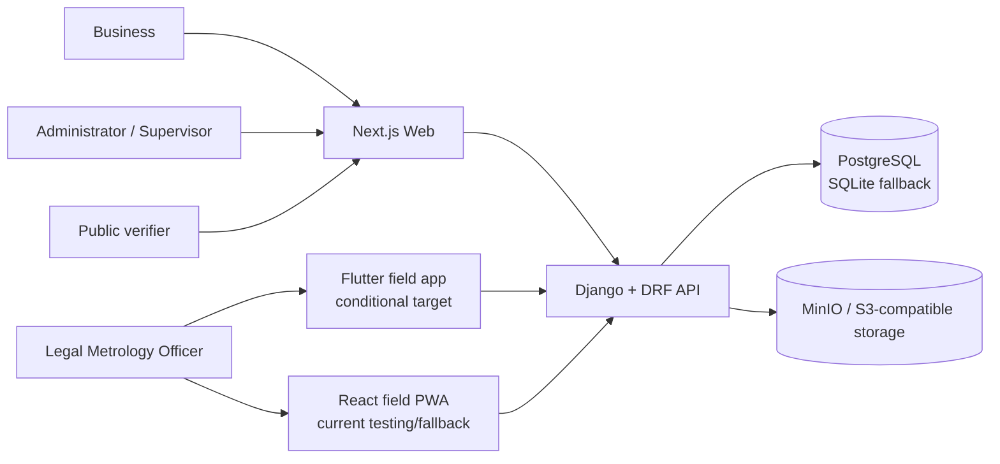
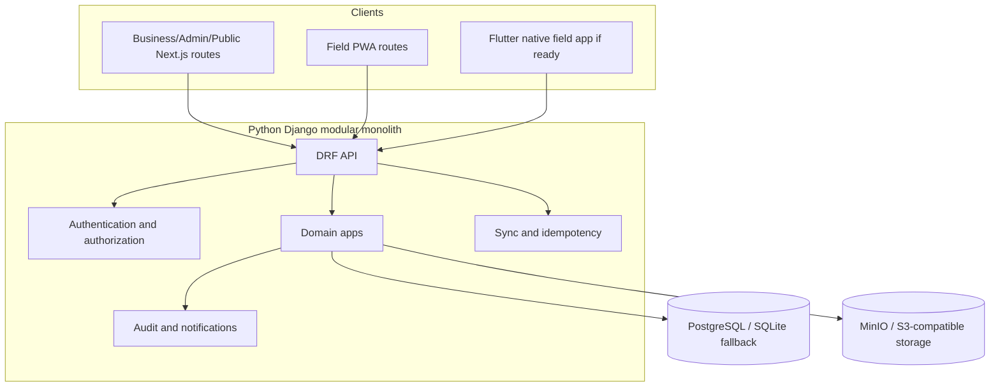

# System Architecture

MapanSetu is a client-independent verification workflow built as one Django modular monolith and one Next.js application. The current checkout is a working scaffold in several areas; this document defines the boundaries that implementation must preserve.

## 1. System context

Actors are Business users, Legal Metrology Officers, Administrators/Supervisors, and public verifiers. Business/admin/public web flows run in Next.js. Officer field work currently runs in the field route group as a React PWA; Flutter/Dart is the conditional native target. Django is the backend authority. PostgreSQL is the target system of record, SQLite is a local fallback, and MinIO/S3-compatible storage is used for binary artifacts when configured.



The system records and coordinates verification work. It does not perform physical statutory verification or grant legal approval.

## 2. Container and request architecture



Every protected request follows: client → API routing → authentication → role/ownership/assignment authorization → serializer/domain validation → Django ORM transaction → object storage where needed → audit/notification → canonical response. Public verification skips login but is rate-limited and returns only minimal public data.

## 3. Backend modules and repository structure

The backend module names are the Django app directories already present under `backend/`:

```text
backend/
  root/            settings.py, URL composition, ASGI/WSGI
  common/          shared backend concerns
  authentication/  identity, login, token/session boundary
  businesses/      business ownership
  instruments/     instrument registry
  applications/    verification requests and lifecycle
  scheduling/      assignment and scheduling
  inspections/     inspection session and measurements
  evidence/        file metadata and object-storage boundary
  certificates/    certificate generation and status
  verification/    public certificate lookup
  notifications/   in-product notifications
  audit/           append-only audit boundary
  sync/            offline operation acceptance and idempotency
```

Each domain app may own `models.py`, `serializers.py`, `services.py`, `views.py`, `urls.py`, and tests. Views stay thin. Serializers own request/response validation and shape; services own domain rules and state transitions; models own persistence mapping; cross-app access uses explicit services rather than ad hoc queries.

## 4. API flow and authority

```text
Web / Flutter / PWA
        |
        v
    Django API
        |
        v
Authentication + RBAC + ownership/assignment
        |
        v
Serializer and domain validation
        |
        v
Django ORM transaction
        |
        +--> PostgreSQL (SQLite fallback locally)
        +--> MinIO/S3 object storage for evidence/PDFs
        +--> AuditLog
        +--> Notification
```

The backend remains authoritative for authentication, authorization, ownership, officer assignment, application transitions, certificate status, sync acceptance, conflict resolution, and public verification. A client-side guard or local state never grants permission.

## 5. Offline architecture

The PWA path is implemented in `frontend/src/offline`, `frontend/src/services/field`, and `frontend/public/sw.js`:

```text
React field routes
      |
IndexedDB / Dexie
      |
Offline drafts + evidence + sync queue
      |
Idempotent /api/v1/sync requests
      |
Django API
```

The conditional Flutter path uses the same contract:

```text
Flutter UI
      |
Flutter local database (package is an open decision)
      |
Offline repository + sync queue
      |
Idempotent /api/v1/sync requests
      |
Django API
```

Do not invent a Flutter database or create server states specific to a client. Canonical local states are `LOCAL_DRAFT`, `READY_TO_SYNC`, `SYNCING`, `SYNCED`, `FAILED`, and `CONFLICT`.

## 6. Certificate trust architecture

```text
Canonical certificate payload
       |
       v
SHA-256 digest
       |
       v
RSA-2048 / RSA-PSS / SHA-256 signature
       |
       v
Certificate PDF/artifact + metadata
       |
       v
QR verification URL
       |
       v
Public verification API
```

QR is only a discovery mechanism. Trust comes from backend status, canonical-payload hash recomputation, and public-key signature verification. The private signing key is backend-only.

## 7. Field-client decision

```text
Flutter ready before internal hackathon?
  YES -> Flutter is the primary field demo; PWA remains testing/fallback.
  NO  -> PWA is the primary field demo; Flutter remains a future target.
```

This gate changes only the field client. It does not change the API contract, logical data model, authentication, certificate architecture, or domain workflow.

## 8. Deployment boundary

The checkout contains no Docker, Compose, Nginx, or CI configuration. Local development is therefore backend process + frontend process, with PostgreSQL/MinIO optional according to environment configuration. Deployment automation is an open implementation task and must not be represented as present infrastructure.
