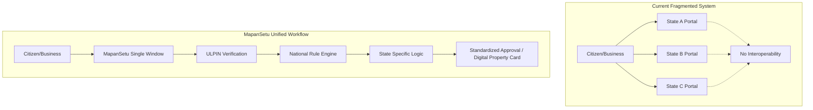
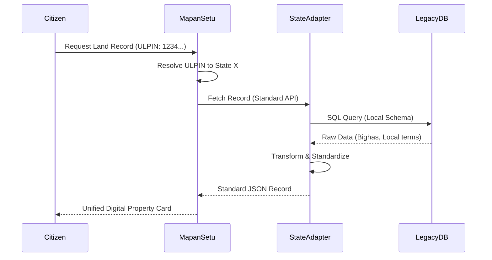

# MapanSetu: "One Nation, One Registration"

## 1. Vision Statement

"One Nation, One Registration" is the driving philosophy behind MapanSetu. It envisions a frictionless, transparent, and universally accessible spatial governance ecosystem for India. Just as financial systems evolved from isolated ledgers to interconnected banking networks, MapanSetu transforms disparate state-level land records and map approval systems into a singular, cohesive national framework. Our vision is to ensure that a citizen or business can register property, obtain mapping approvals, and verify land titles with the same ease and standardized process anywhere in the country, from Kashmir to Kanyakumari.

## 2. Current Fragmentation Problem

The current landscape of spatial data and land registration in India is highly fragmented, posing severe challenges to economic growth and governance.

- **36 Disparate Systems:** Each of the 36 States and Union Territories operates its own proprietary system for map approvals and land records.
- **Inconsistent Formats:** A property document in Tamil Nadu looks entirely different from one in Punjab. Terminology, measurement units (e.g., Bigha, Guntha, Acre), and data structures vary wildly.
- **Bureaucratic Labyrinths for Businesses:** Corporations attempting to set up pan-India operations must navigate 36 different regulatory regimes, each with its own fee structure, required documents, and offline processes.
- **Lack of Standardized Identification:** There is no universal identifier for land parcels, making it impossible to uniquely pinpoint a property on a national scale without ambiguity.
- **Cross-State Friction:** Inter-state infrastructure projects (highways, pipelines) face massive delays as project coordinators struggle to reconcile conflicting mapping data and coordinate acquisitions across state borders.

## 3. The ULPIN Revolution

At the heart of MapanSetu's unification strategy is the integration and enforcement of the Unique Land Parcel Identification Number (ULPIN)—the "Aadhaar for Land."

### How ULPIN Works
ULPIN is a 14-digit alphanumeric unique ID for every surveyed parcel of land.
- **Generation Algorithm:** It is based on the longitude and latitude coordinates of the land parcel nodes. It conforms to international standards (e.g., OGC) and the Electronic Commerce Code Management Association (ECCMA) standard.
- **Structure:** The ID mathematically ties the record to specific spatial coordinates, ensuring that the identifier cannot be duplicated or ambiguously assigned.

### Interconnected Ecosystem
- **Linking to Aadhaar:** ULPIN can be linked to the Aadhaar numbers of the legitimate owners, establishing an unbreakable link between identity and property.
- **Linking to Property Records (RoR):** The ULPIN acts as the primary key connecting the spatial shape (polygon) on the map to the textual Record of Rights (RoR).
- **National-Level Searchability:** With ULPIN, a bank in Mumbai can instantly and confidently verify the collateral value of a land parcel in rural Bihar using a single API call.

## 4. Unified Workflow

MapanSetu introduces a paradigm shift in how spatial approvals are processed.

- **Single Registration Process:** Citizens and businesses create a single MapanSetu account (using Aadhaar/PAN) that is valid nationwide.
- **Standardized Document Requirements:** The platform enforces a common baseline of required documents for typical approvals (e.g., building plans), significantly reducing confusion.
- **Uniform Fee Structure with State Customization:** While the core fee calculation logic is standardized, states retain the autonomy to plug in their local multipliers and circle rates.
- **Cross-State Data Portability:** Digital property cards and NOCs are issued in a standardized, machine-readable format (JSON/XML) with digital signatures, making them portable and verifiable across state lines.

## 5. Analogy with GST

The impact of MapanSetu on spatial governance is analogous to the impact of the Goods and Services Tax (GST) on taxation.

- **Before GST:** Multiple cascading taxes, inter-state checkposts, complex compliance for businesses, and high tax evasion.
- **With GST:** "One Nation, One Tax" - unified portal, seamless input tax credit, standardized processes, and massive revenue growth.
- **Before MapanSetu:** Fragmented land records, state-specific portals, manual verifications, and rampant property disputes.
- **With MapanSetu:** "One Nation, One Registration" - unified portal, instant ULPIN verification, standardized spatial data, and massive reduction in litigation.

Just as GST unified the economic market of India, MapanSetu unifies the spatial and geographical administration of the country.

## 6. Technical Implementation

To achieve this ambitious vision without disrupting ongoing state operations, MapanSetu employs a sophisticated technical architecture.

- **State Adapter Pattern:** MapanSetu does not immediately force states to abandon their legacy databases. Instead, it deploys "Adapters" that sit on top of existing state databases (like Bhulekh), translating their local data into the unified MapanSetu schema in real-time.
- **Gradual Migration Strategy:** States can initially plug into MapanSetu as a facade. Over time, as legacy systems reach their end-of-life, states can migrate their data entirely to MapanSetu's highly available central cloud infrastructure.
- **Data Standardization Pipeline:** An automated ETL (Extract, Transform, Load) pipeline uses AI to clean legacy data, map local measurement units to standard SI units, and flag inconsistencies for manual review.
- **Interoperability Protocols:** RESTful APIs and GraphQL endpoints expose the unified data layer to authorized third parties securely.

## 7. Benefits Matrix

| Stakeholder | Key Benefits |
| :--- | :--- |
| **Citizens** | Single portal for all property needs; Instant verification; Protection from fraud; Remote access to records. |
| **Businesses** | Standardized pan-India APIs; Rapid site acquisition; Reduced legal due diligence costs; Ease of doing business. |
| **State Governments** | Reduced IT maintenance costs; Elimination of revenue leakage; Improved administrative efficiency. |
| **Central Government** | Real-time national spatial intelligence; Seamless coordination for infra projects; Policy data backing. |
| **Judiciary** | Massive reduction in property disputes; Immutable, mathematically verifiable land titles to resolve cases faster. |
| **Banks & Lenders** | Instant collateral verification; Significant reduction in NPA risks arising from fraudulent mortgages. |

## 8. Implementation Phases

Rolling out a unified system across a country as vast as India requires a phased, pragmatic approach.

### Phase 1: Pilot States (Months 1-6)
- **Objective:** Prove the concept and refine the State Adapter architecture.
- **Action:** Integrate 3-4 technologically progressive states (e.g., Karnataka, Maharashtra, Telangana) that already have mature digitized land records.
- **Deliverables:** Core portal launch, ULPIN generation engine, basic read-only APIs for property verification.

### Phase 2: Tier-1 Integration (Months 7-18)
- **Objective:** Expand the footprint and introduce write operations.
- **Action:** Onboard remaining major states. Implement standardized map approval workflows (building plan NOCs).
- **Deliverables:** Cross-state searchability, payment gateway integration for standardized fees, blockchain ledger for immutable transaction logging.

### Phase 3: National Rollout (Months 19-36)
- **Objective:** Achieve full pan-India coverage.
- **Action:** Onboard difficult terrains and states with less digitized legacy records, utilizing the AI data standardization pipeline heavily.
- **Deliverables:** 100% ULPIN coverage, integration with national PM GatiShakti portal, advanced predictive analytics dashboard for policymakers.

### Phase 4: International Integration (Year 4+)
- **Objective:** Establish MapanSetu as a global standard for spatial governance.
- **Action:** Expose public standards and open-source core modules as a Digital Public Good.
- **Deliverables:** Integration with international spatial frameworks, capability to assist neighboring countries in establishing similar "One Nation, One Registration" systems.
