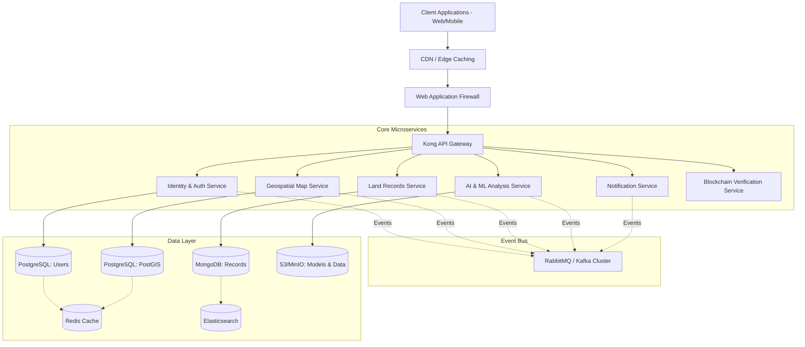

# MapanSetu: Scalability and National-Scale Architecture

## 1. Scalability Vision

MapanSetu is conceptualized and engineered to serve the vast demography and complex administrative structure of India. With a population exceeding 1.4 billion citizens distributed across 28 states and 8 Union Territories, the platform must seamlessly handle an immense volume of concurrent users, massive geospatial datasets, and high-throughput transactional records. 

Our scalability vision is rooted in three core principles:
- **Elasticity:** The system must automatically scale up during peak hours (e.g., typical government working hours, 10 AM to 5 PM IST) and scale down during off-peak hours to optimize costs.
- **Resilience:** There must be zero single points of failure. The system must degrade gracefully and recover automatically in the event of hardware or network failures.
- **Data Locality and Compliance:** Adhering strictly to Indian data residency laws and state-specific governance rules by ensuring multi-region deployments within Indian geographical boundaries.

MapanSetu aims to support 100+ million registered users, handle over 5,000 concurrent map interactions per second, and process 10,000+ document uploads/verifications per minute during peak loads.

---

## 2. Architecture for Scale

The system utilizes a distributed Microservices architecture. This allows distinct functional domains (User Management, Map Processing, Land Records, AI Analysis) to scale independently based on their unique computational requirements.

### Microservices Architecture Diagram



### Key Architectural Decisions
- **Event-Driven Communication:** We utilize RabbitMQ to decouple services. For instance, when a new land map is uploaded, the `Map Service` publishes an event. The `AI Service` picks this up asynchronously, preventing the user from waiting for deep analysis.
- **Kong API Gateway:** Acts as the unified entry point. Handles rate limiting (crucial for DDoS protection), JWT validation, and intelligent routing.
- **Stateless Services:** All microservices are entirely stateless. User sessions and application states are stored in Redis. This allows horizontal scaling where Kubernetes can spin up new pod replicas instantly.

---

## 3. Database Scalability

Handling national-level data requires specialized database strategies.

### PostgreSQL with PostGIS (Relational & Geospatial)
PostgreSQL is our primary datastore for structured data and complex geospatial queries (via PostGIS).
- **Read Replicas:** We maintain 1 Primary (Write) and 3-5 Read Replicas distributed across availability zones. Traffic is routed via PgBouncer.
- **Connection Pooling:** PgBouncer ensures database connections are multiplexed, preventing connection starvation under load.
- **Table Partitioning by State:** The `land_parcels` table is partitioned by state code (e.g., `UP`, `KA`, `MH`). This keeps index sizes manageable and speeds up state-specific queries.
- **Spatial Indexing:** Extensive use of GiST and SP-GiST indexes to optimize bounding box and polygon intersection queries.

### MongoDB (Unstructured & Document Data)
Used for storing heterogeneous land records, approval workflows, and flexible metadata.
- **Sharding Strategy:** Sharded based on `hash(district_id)` to ensure an even distribution of data and avoid hotspotting.
- **Replica Sets:** 3-node replica sets in each region for high availability and automatic failover.

### Redis (Caching & Session Management)
- **Cluster Mode:** Redis Cluster with 6 nodes (3 masters, 3 slaves) handles session state, API response caching, and temporary locking mechanisms.
- **Cache-Aside Pattern:** Services read from Redis first; on a miss, they read from the DB and populate Redis.
- **Session Distribution:** JWT tokens and session metadata are stored centrally, allowing any stateless pod to authenticate any request.

### Elasticsearch (Search & Discovery)
- **Index Lifecycle Management (ILM):** Old access logs and audit trails roll over to cheaper storage tiers automatically.
- **Cross-Cluster Search:** Allows seamless querying across regional Elasticsearch deployments for pan-India analytics.

---

## 4. Kubernetes Infrastructure

MapanSetu is orchestrated entirely on Kubernetes (EKS/AKS), designed for autonomous scaling and healing.

### Autoscaling Mechanisms
- **Horizontal Pod Autoscaler (HPA):** Pods scale out based on CPU > 70% or Memory > 80%. Custom metrics (e.g., RabbitMQ queue depth) also trigger HPA.
- **Vertical Pod Autoscaler (VPA):** Evaluates historical resource usage and adjusts CPU/Memory requests for AI processing pods dynamically.
- **Cluster Autoscaler:** Provisions new underlying VM nodes when pods are pending due to insufficient cluster capacity.

### Deployment Resilience
- **Multi-Region Deployment:** Clusters run actively in multiple regions.
- **Pod Disruption Budgets (PDB):** Ensures a minimum number of critical pods (e.g., Auth Service) remain active during node maintenance or upgrades.
- **Rolling Updates:** Zero-downtime deployments via native K8s rolling update strategies and readiness/liveness probes.

```yaml
# Example HPA Configuration for Map Service
apiVersion: autoscaling/v2
kind: HorizontalPodAutoscaler
metadata:
  name: map-service-hpa
spec:
  scaleTargetRef:
    apiVersion: apps/v1
    kind: Deployment
    name: map-service
  minReplicas: 3
  maxReplicas: 50
  metrics:
  - type: Resource
    resource:
      name: cpu
      target:
        type: Utilization
        averageUtilization: 70
```

---

## 5. CDN & Static Assets

- **CloudFront / Azure CDN:** Used for delivering the React/Next.js frontend and static assets globally.
- **Edge Caching for Map Tiles:** Vector map tiles (MVT) generated by the Map Service are heavily cached at the CDN edge. A tile requested by one user in a district is instantly available from the edge node for subsequent users.
- **Static Asset Optimization:** GZIP and Brotli compression, combined with aggressive Cache-Control headers for immutable assets.

---

## 6. Performance Benchmarks (Projected)

The platform is designed to meet stringent SLAs even under 100% capacity utilization.

| Metric | Target | P50 (Median) | P95 | P99 |
|--------|--------|--------------|-----|-----|
| Auth API Response | < 100ms | 30ms | 60ms | 95ms |
| Map Tile Serving | < 50ms | 15ms (Cache) | 30ms | 45ms |
| Spatial Query | < 300ms | 80ms | 150ms | 280ms |
| File Upload (10MB)| < 2s | 800ms | 1.2s | 1.9s |
| Search Query | < 150ms | 40ms | 90ms | 140ms |

**Throughput Capacity:**
- Concurrent Users: 500,000
- Map Tile Requests: 25,000 req/sec
- API Requests: 15,000 req/sec

---

## 7. Load Testing Strategy

We rely on `k6` for continuous performance testing integrated into our CI/CD pipelines.

### Testing Scenarios
1. **Smoke Testing:** Verifies the system can handle minimal load (sanity check).
2. **Load Testing:** Simulates a normal day with peak usage (e.g., 50,000 VUs) over 1 hour.
3. **Stress Testing:** Pushes the system beyond expected maximums (e.g., 200,000 VUs) to find breaking points and observe recovery.
4. **Spike Testing:** Sudden surge in traffic (e.g., announcing a new land policy) to test the responsiveness of HPA and Cluster Autoscaler.

### Performance Thresholds
Automated pipeline failures occur if:
- Error rate > 1%
- P95 API response > 250ms

---

## 8. Multi-Region Deployment

To ensure low latency across India and comply with disaster recovery mandates.

### Region Mapping
| Region | Location | Primary Purpose | Database Role |
|--------|----------|-----------------|---------------|
| North | Delhi-NCR | Core processing for Northern states | Primary Write / Read Replicas |
| West | Mumbai | Core processing for Western states | Active-Active / Regional DB |
| South | Hyderabad | Core processing for Southern states | Active-Active / Regional DB |
| East | Kolkata | Core processing for Eastern states | Read Replicas / Backup |

### Geo-Routing & Data Residency
- **Route53 / Traffic Manager:** Uses latency-based routing to direct users to the nearest region.
- **Cross-Region Replication:** Asynchronous replication handles failover data sync, ensuring data isn't lost if an entire region goes down.

---

## 9. Disaster Recovery

Our Disaster Recovery (DR) plan is built to ensure minimal disruption to critical government services.

- **RPO (Recovery Point Objective):** < 15 minutes (maximum acceptable data loss).
- **RTO (Recovery Time Objective):** < 4 hours (maximum acceptable downtime).
- **Automated Failover:** If the Primary Region (e.g., Delhi) goes down, DNS automatically re-routes traffic to the Secondary Region (e.g., Mumbai). Databases are promoted from read-replicas to primary masters automatically.
- **Backup Strategy:** 
  - Hourly differential backups.
  - Daily full backups stored in immutable WORM (Write Once Read Many) cloud storage to prevent ransomware.
- **Chaos Engineering:** Monthly automated simulations (e.g., terminating random nodes, dropping database connections) to validate resilience.

---

## 10. Cost Optimization

Running a pan-India platform requires rigorous cost management.
- **Spot Instances:** Used extensively for stateless batch processing, background AI analysis, and CI/CD pipelines (saving up to 70%).
- **Reserved Instances / Savings Plans:** Procured for baseline database and core API workloads that run 24/7.
- **Auto-Scaling:** Scaling down non-essential pods during nighttime hours (IST 11 PM to 6 AM).
- **Storage Tiering:** Land records older than 5 years are automatically moved to S3 Standard-IA, and those older than 10 years to S3 Glacier/Archive.

---

## 11. Capacity Planning

Projections for hardware provisioning and budget allocation over the next 5 years.

### Growth Projections
| Year | Registered Users | Storage Needs | Compute Nodes (Avg) |
|------|------------------|---------------|---------------------|
| Yr 1 | 5 Million | 50 TB | 150 |
| Yr 2 | 15 Million | 120 TB | 300 |
| Yr 3 | 40 Million | 300 TB | 650 |
| Yr 4 | 75 Million | 600 TB | 1200 |
| Yr 5 | 100+ Million | 1+ PB | 2000 |

### Resource Sizing Guidelines
- **API Nodes:** Compute optimized instances (e.g., AWS C6g / Azure Fsv2).
- **Database Nodes:** Memory optimized instances (e.g., AWS R6g / Azure Esv4) with Provisioned IOPS SSDs.
- **AI Nodes:** GPU-enabled instances (e.g., AWS G4dn / Azure NCasT4) for running computer vision models on satellite imagery.

---
*MapanSetu Architecture Team - SIH 2026 Documentation*
